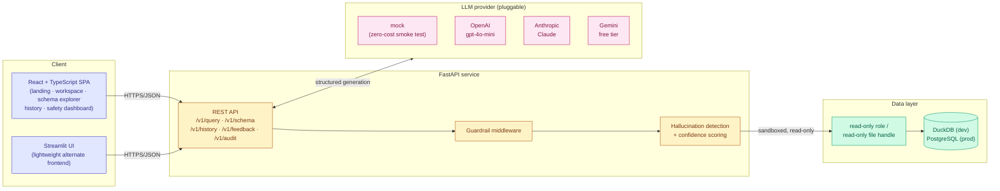
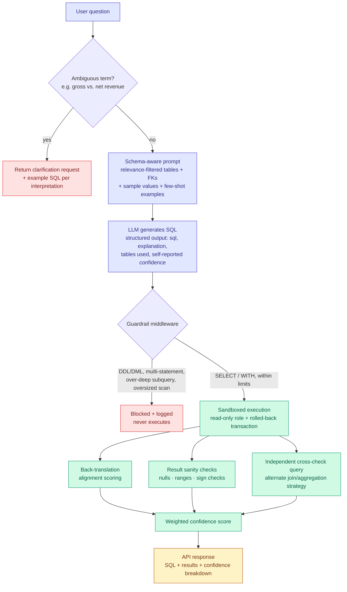

# SafeSQL

**Natural-language to SQL with guardrails and hallucination detection.**

SafeSQL translates plain-English questions into SQL against a real database, then treats the
generated query as untrusted by default: it is safety-checked before it ever reaches the database,
executed read-only inside a sandboxed transaction, and shipped with a confidence score built from
independent correctness signals — never just the model's own self-report.

[](https://www.python.org/)
[](https://fastapi.tiangolo.com/)
[](https://react.dev/)
[](eval/eval_report.md)
[](eval/eval_report.md)

**Lead with safety, not accuracy** — a wrong-but-cautious answer is recoverable; an unsafe query
that mutates data is not.

---

## Contents

- [Headline numbers](#headline-numbers-smoke-test-run-llm_providermock)
- [System architecture](#system-architecture)
- [Request pipeline](#request-pipeline)
- [Domain](#domain)
- [Safety layers](#safety-layers-defense-in-depth)
- [Hallucination detection](#hallucination-detection)
- [Ambiguity handling](#ambiguity-handling)
- [Project layout](#project-layout)
- [Getting started](#getting-started)
- [API reference](#api-reference)
- [Evaluation](#evaluation)

---

## Headline numbers (smoke-test run, `LLM_PROVIDER=mock`)

> These numbers come from the deterministic **mock** LLM provider (no API key, zero cost) — it only
> exists to exercise the full pipeline end-to-end in CI/dev. It is **not** a text-to-SQL model, so
> SQL-exact/execution-match numbers below are a floor, not a ceiling. Run `python eval/run_eval.py`
> with `LLM_PROVIDER=openai`, `anthropic`, or `gemini` and a real key for representative accuracy —
> see [Evaluation](#evaluation).

| Metric | Result |
|---|---|
| Guardrail effectiveness | **8 / 8 (100%)** dangerous queries blocked — DROP, DELETE, UPDATE, INSERT, ALTER, TRUNCATE, stacked statements, over-deep subqueries |
| Unsafe queries ever executed | **0** |
| Ambiguity detection | **4 / 4 (100%)** — underspecified terms like "revenue" trigger clarification instead of a guessed answer |
| Golden evaluation cases | 42 (simple / joins / aggregates / date filters / ambiguous / unanswerable) |

Full breakdown: [`eval/eval_report.md`](eval/eval_report.md).

---

## System architecture



The frontend never talks to the database directly, the LLM never talks to the database at all, and
every code path between "user question" and "rows on screen" passes through the guardrail and
validation layers in the backend — regardless of which UI or which model provider is in use.

---

## Request pipeline



No question reaches the database directly. Every one passes through an ambiguity check, a
schema-filtered prompt, guardrail middleware, and sandboxed execution, then three independent
hallucination-detection signals before a confidence score is computed.

---

## Domain

An e-commerce analytics schema: `customers`, `categories`, `products`, `orders`, `order_items`,
`reviews`. Seeded deterministically with Faker (~500 customers, 200 products, 2,000 orders, ~6,000
order line items, 1,500 reviews). `revenue` is deliberately ambiguous (gross vs. net) to exercise
the clarification flow.

---

## Safety layers (defense in depth)

| Layer | Mechanism | Why it matters |
|---|---|---|
| **1. Prompt-level** | The system prompt forbids anything but `SELECT` | The first, cheapest line of defense — and the one most systems stop at |
| **2. Guardrail middleware** | `app/guardrails.py`, `sqlparse`-based, every rule independently configurable via `.env`: blocks all DDL (`CREATE`/`ALTER`/`DROP`/`TRUNCATE`) and DML writes (`INSERT`/`UPDATE`/`DELETE`), rejects multi-statement/stacked SQL, auto-injects `LIMIT 1000` when missing, caps subquery nesting depth, and (when `EXPLAIN` gives a numeric row estimate) blocks oversized scans. Every block is logged with reason, timestamp, question, and rejected SQL (`app.guardrails.AUDIT_LOG`, exposed via `GET /v1/audit`) | Evaluated before execution, not after — nothing unsafe ever touches the database |
| **3. Sandboxed execution** | `app/sql_executor.py` runs inside a transaction that is always rolled back, connected through a dedicated **read-only database role** — on Postgres, `safesql_reader` has `SELECT`-only grants (`data/postgres_init.sql`); on DuckDB, the file is opened in `read_only` mode | If the first two layers ever miss something, this one still can't be bypassed |

---

## Hallucination detection

- **Back-translation** — the LLM restates, in its own words, what question its generated SQL
  answers; that restatement is scored (token-set similarity) against the original question. Low
  alignment flags a likely mismatch.
- **Result sanity checks** — NULL-heavy result columns (bad JOIN signal), negative values in
  sum/count-style columns, out-of-range ratings, empty results.
- **Multi-query agreement** — a second, independently-prompted SQL query (different join/aggregation
  strategy) is generated and executed; agreement between the two is a strong correctness signal,
  disagreement surfaces both queries side by side.
- **Confidence score** (`app/confidence.py`) — a weighted combination of syntax validity,
  back-translation alignment, sanity-check pass rate, multi-query agreement, and a schema-coverage
  heuristic (does the query's structure — joins, aggregates, date filters — match what the
  question's phrasing implies?). Shown prominently, broken down by component, next to every result.

---

## Ambiguity handling

Terms with more than one reasonable SQL meaning (e.g. "revenue" = gross vs. net) are caught before
generation and returned as a structured clarification request with example SQL for each
interpretation — rather than the system silently picking one. A question that already disambiguates
itself ("net revenue") is *not* flagged. See `app/prompts.py::AMBIGUOUS_TERMS` /
`build_ambiguity_check`.

---

## Project layout

```
app/
  config.py                settings (env-driven)
  db.py                     SQLAlchemy engine factory (duckdb today, postgres-ready; separate read-only reader engine)
  schema_introspect.py      SQLAlchemy Inspector -> structured schema + sample values
  schema_filter.py          relevance filtering so only likely-needed tables go in the prompt
  prompts.py                dynamic prompt constructor + few-shot bank + ambiguity glossary
  llm_client.py             provider-agnostic client: mock | openai (gpt-4o-mini) | anthropic (claude) | gemini (free tier)
  models.py                 pydantic request/response schemas
  guardrails.py             safety middleware + audit log
  sql_executor.py           sandboxed read-only execution
  validation.py             hallucination-detection signals
  confidence.py             combined confidence score
  history.py                session history + feedback store
  main.py                   FastAPI app

frontend-web/                React + TypeScript SPA: landing page, query workspace,
                              live schema explorer, session history, safety dashboard
frontend/streamlit_app.py    lightweight alternate UI: NL input, editable SQL, results,
                              confidence breakdown, history, feedback

eval/golden_queries.json     42 NL questions (simple/join/aggregate/date-filter/ambiguous/unanswerable) + 8 adversarial SQL cases
eval/run_eval.py             computes eval numbers, writes eval/eval_report.md

data/schema.sql, seed.py     DDL + deterministic Faker seeding
data/postgres_init.sql       creates the read-only Postgres role (Postgres path only)

docker-compose.yml, Dockerfile   Postgres + API + frontend orchestration (opt-in, see below)
```

---

## Getting started

### Option A — DuckDB, no Docker (fastest way to try it today)

```bash
python -m venv .venv && .venv\Scripts\activate   # Windows
pip install -r requirements.txt
copy .env.example .env
python data/seed.py
uvicorn app.main:app --reload
```

By default `.env` has `LLM_PROVIDER=mock`, so the whole pipeline (guardrails, sandboxing,
hallucination checks, confidence scoring) runs with zero API cost. To use a real model, set one of:

```env
LLM_PROVIDER=openai
OPENAI_API_KEY=sk-...
OPENAI_MODEL=gpt-4o-mini            # cheapest capable option
```

```env
LLM_PROVIDER=anthropic
ANTHROPIC_API_KEY=sk-ant-...
ANTHROPIC_MODEL=claude-sonnet-5
```

```env
LLM_PROVIDER=gemini                 # $0 cost — aistudio.google.com/apikey
GEMINI_API_KEY=AIza...
GEMINI_MODEL=gemini-2.0-flash
```

**Frontend — React app (primary UI):**

```bash
cd frontend-web
npm install
npm run dev
```

**Frontend — Streamlit (lightweight alternate UI):**

```bash
streamlit run frontend/streamlit_app.py
```

### Option B — PostgreSQL via Docker Compose (production-shaped path)

```bash
docker compose up --build
```

This starts Postgres, seeds it (one-off `seed` service), then starts the API (`:8000`) and the
Streamlit UI (`:8501`). Set `LLM_PROVIDER` / `OPENAI_API_KEY` / `ANTHROPIC_API_KEY` /
`GEMINI_API_KEY` as environment variables before running, or in a `.env` file next to
`docker-compose.yml` (Compose reads it automatically). Switching from Option A requires no code
changes — only `DB_BACKEND=postgres` plus connection settings, since everything goes through the
same SQLAlchemy engine abstraction (`app/db.py`).

---

## API reference

| Endpoint | Description |
|---|---|
| `POST /v1/query` | `{question, session_id?, force_interpretation?}` → SQL, explanation, results, confidence breakdown, guardrail warnings, or a clarification request |
| `GET /v1/schema` | Introspected schema (tables, columns, types, FKs, sample values) |
| `GET /v1/history?session_id=` | Past queries for a session |
| `POST /v1/feedback` | `{query_id, correct, notes}` — records correctness feedback (the flywheel: wrong answers become eval regressions, correct ones become candidate few-shot examples) |
| `GET /v1/audit?limit=` | Recent guardrail activity (blocks + warnings), most recent first |

---

## Evaluation

```bash
python eval/run_eval.py
```

Reports, over 42 golden NL questions (simple lookups, multi-table JOINs, GROUP BY aggregations,
date-range filters, deliberately ambiguous phrasing, and out-of-schema/unanswerable questions) plus
8 adversarial SQL cases run directly through the guardrail layer:

- SQL exact match & execution-result match against golden queries
- Ambiguity-detection rate (did it ask instead of guess?)
- Unanswerable-question hallucination avoidance
- Guardrail block rate (dangerous queries stopped before reaching the database)

Full current output: [`eval/eval_report.md`](eval/eval_report.md).
